# SystemVerilog: Advanced Encryption Standard (AES)

## Description

This project is an implementation of the AES in CTR mode using SystemVerilog.

AES (Advanced Encryption Standard) is a symmetric encryption algorithm established by the U.S. National Institute of Standards and Technology (NIST) in 2001, known for its security, efficiency, and flexibility with key sizes of 128, 192, or 256 bits. It is widely used for securing data in various applications, from government communications to everyday internet transactions.

CTR (Counter) mode is an encryption method that transforms plaintext blocks into ciphertext blocks by XORing them with a keystream generated from a block cipher. It is a stream cipher that provides parallel processing and random access capabilities, making it suitable for applications that require high throughput and low latency.

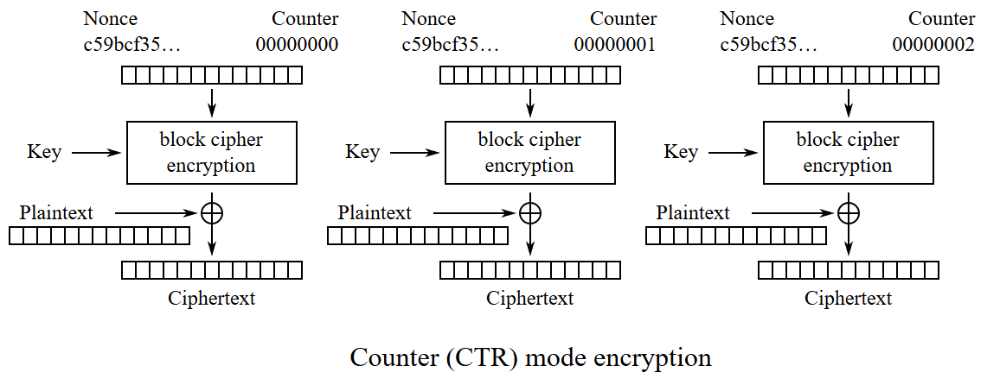
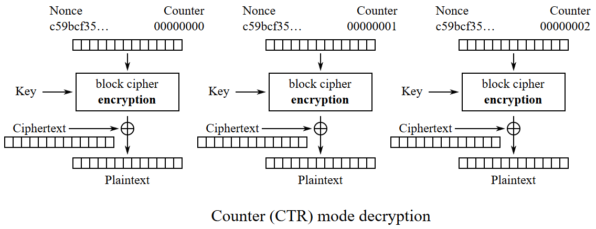

## Design

### Module hierarchy

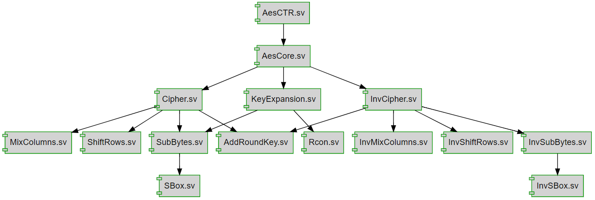

### [AesCtr module](AES.srcs/sources_1/new/AesCTR.sv)

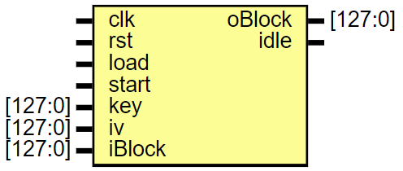

The `AesCtr` module is the top-level module that instantiates the `AesCore` module to perform the AES encryption and decryption operations in CTR mode using an FSM with the following states:

- `IDLE`: The initial state where the module waits for the `load` or the `start` signal to be asserted. When `load` is asserted, the module stores the `key` and `iv` values and transitions to the `KEY_EXPANSION` state. When `start` is asserted, the module transitions to the `RUNNING` state.
- `KEY_EXPANSION`: The state where the module waits for the `AesCore` module to generate the round keys. When the round keys are generated (i.e., `AesCore`'s `idle` signal is asserted), the module returns to the `IDLE` state.
- `RUNNING`: The state where the module passes the `counter` value to the `AesCore` module to generate the keystream. When the keystream is generated (i.e., `AesCore`'s `idle` signal is asserted), the module increments the `counter` and returns to the `IDLE` state.

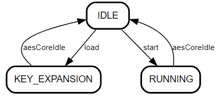

You have to load the `key` and `iv` (initialization vector) before starting the encryption or decryption process. The `key` and `iv` are loaded when the `load` signal is asserted in 1 cycle. To make the module work correctly, you must load the `key` and `iv` when the module is in the `IDLE` state.

The output of the `AesCtr` (i.e., `oBlock`) is the XORed result of the input block (`iBlock`) and the keystream generated by the `AesCore` module, which is only valid when the `idle` signal is asserted.

### [AesCore module](AES.srcs/sources_1/new/AesCore.sv)

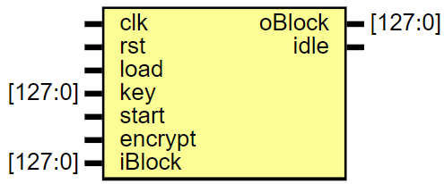

The `AesCore` module is the core module that performs the AES encryption and decryption operations using `KeyExpansion`, `Cipher`, and `InvCipher` modules. It uses the `encrypt` signal to select between encryption and decryption operations. When `encrypt` is asserted, the module performs the encryption operation; otherwise, it performs the decryption operation. The `idle` signal is asserted when the operation is completed.

The `AesCore` module has an FSM with the following states:

- `IDLE`: The initial state where the module waits for the `load` or the `start` signal to be asserted. When `load` is asserted, the module starts the `KeyExpansion` module to generate the round keys, and transitions to the `KEY_EXPANSION` state. When `start` is asserted, the module starts the `Cipher` and `InvCipher` modules to perform the encryption or decryption operation and transitions to the `RUNNING` state.
- `KEY_EXPANSION`: The state where the module waits for the `idle` signal of the `KeyExpansion` module to be asserted. The module returns to the `IDLE` state when the `idle` of the `KeyExpansion` module is asserted.
- `RUNNING`: The state where the module waits for the `idle` signal of the `Cipher` or `InvCipher` (depending on the `encrypt` signal) module to be asserted. When `idle` is asserted, the module transitions back to the `IDLE` state.

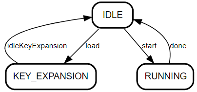

The output of the `AesCore` is multiplexed between the output of the `Cipher` and `InvCipher` modules based on the `encrypt` signal. Therefore, you must wait for the `idle` signal to be asserted and then read the output of the `AesCore` module without changing the `encrypt` signal to get the correct result.

### [KeyExpansion module](AES.srcs/sources_1/new/KeyExpansion.sv)

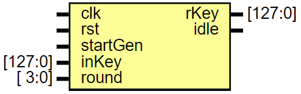

The `KeyExpansion` module generates the round keys from the input `iKey`. The diagram below shows the key expansion FMS:

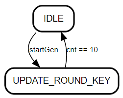

> **Note:** You can find the Pseudocode in chapter 5.2 of the [AES specification](https://nvlpubs.nist.gov/nistpubs/FIPS/NIST.FIPS.197-upd1.pdf).

### [Cipher](AES.srcs/sources_1/new/Cipher.sv) and [InvCipher module](AES.srcs/sources_1/new/InvCipher.sv)

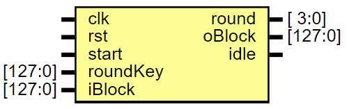

The `Cipher` and `InvCipher` modules perform the AES encryption and decryption operations, respectively.

The following diagram shows the FSM of the `Cipher` module. For more information about the AES encryption operation, refer to chapter 5.1 of the [AES specification](https://nvlpubs.nist.gov/nistpubs/FIPS/NIST.FIPS.197-upd1.pdf).

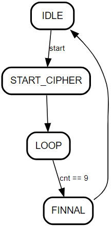

The following diagram shows the FSM of the `InvCipher` module. For more information about the AES decryption operation, refer to chapter 5.3 of the [AES specification](https://nvlpubs.nist.gov/nistpubs/FIPS/NIST.FIPS.197-upd1.pdf).

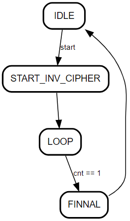

### [SubBytes](AES.srcs/sources_1/new/SubBytes.sv) and [InvSubBytes module](AES.srcs/sources_1/new/InvSubBytes.sv)

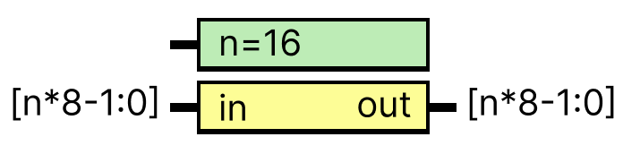

The `SubBytes` and `InvSubBytes` modules perform the bytes substitution operation and its inverse, respectively. These modules have a parameter `n` (default value is 16) to determine the bus width (in bytes) of the input and output data.

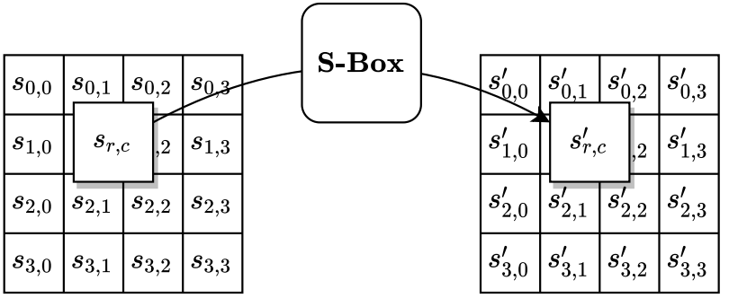

### [ShiftRows](AES.srcs/sources_1/new/ShiftRows.sv) and [InvShiftRows module](AES.srcs/sources_1/new/InvShiftRows.sv)

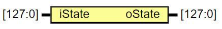

The `ShiftRows` and `InvShiftRows` modules perform the row shifting operation and its inverse, respectively.

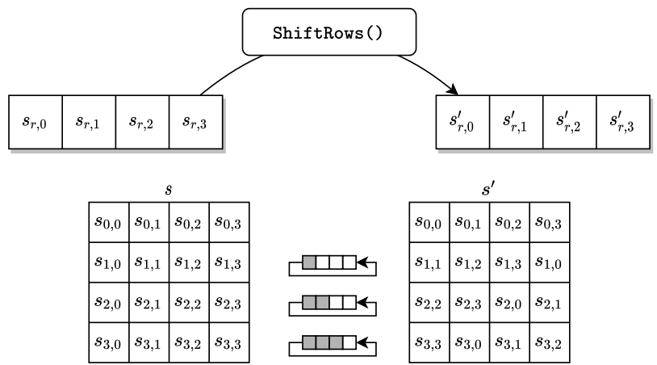
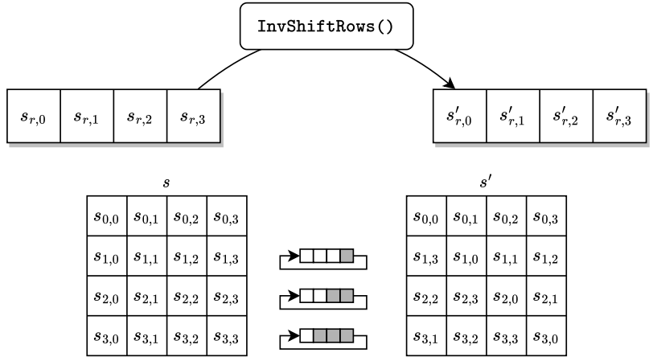

### [MixColumns](AES.srcs/sources_1/new/MixColumns.sv) and [InvMixColumns module](AES.srcs/sources_1/new/InvMixColumns.sv)

The `MixColumns` and `InvMixColumns` modules transform the state matrix by multiplying it with a fixed matrix.

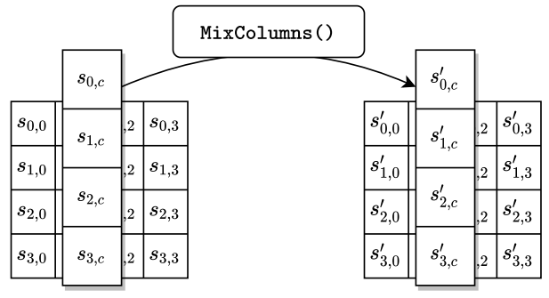

### [AddRoundKey module](AES.srcs/sources_1/new/AddRoundKey.sv)

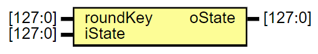

The `AddRoundKey` module performs the XOR operation between the state matrix and the round key.

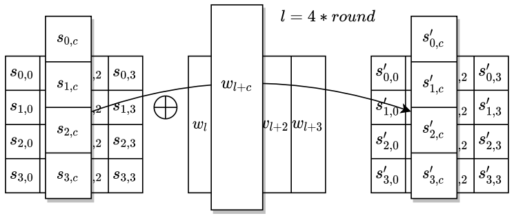

## Synthesis results

Tool: Vivado 2020.2

Device: Arty A7-35T (xc7a35ticsg324-1L)

Resource:

- LUTs: 2189
- FFs: 1938

## References

- [Specification for the ADVANCED ENCRYPTION STANDARD (AES)](https://nvlpubs.nist.gov/nistpubs/FIPS/NIST.FIPS.197-upd1.pdf)

<!-- https://visitorbadge.io/status?path=https://github.com/HM-Huong/systemverilog_AES -->

